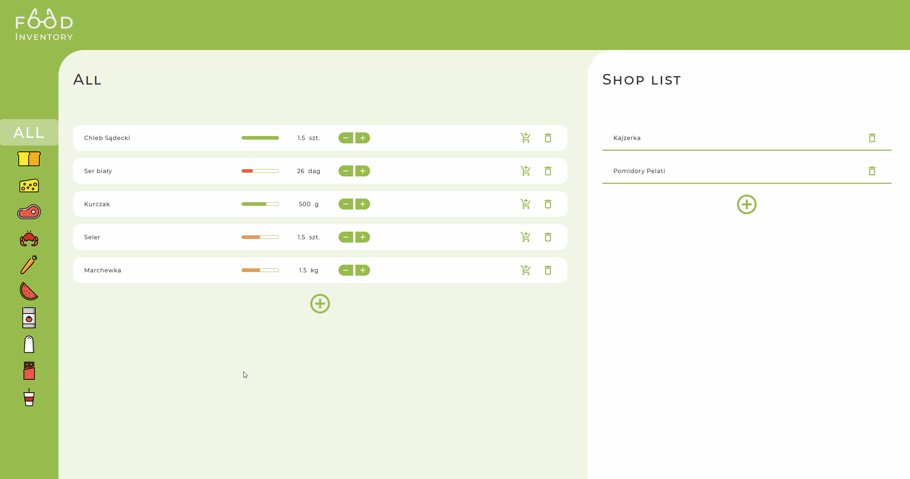

# Food-Inventory 🍆🥦🥔🍞
Web app built with React for managing food in home. It helps to track current levels of food and plans shopping list. The objective of building this app was to practice and consolidate achieved knowledge. At the beginning of project was assumed to use Redux for managing app state and to style website with css in js.

### Main functionalities:
- adding and removing products
- categorization of managed food 
- status of current level regard to the minimal quantity 
- creating of grocery list 

### Used technology:

